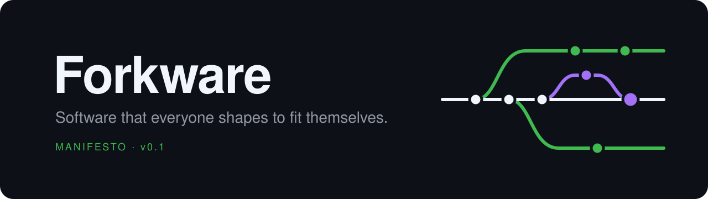

<!-- forkware:template -->
<p align="center">
  
</p>

<p align="center">
  <a href="forkware/manifesto.md"></a>
  <a href="LICENSE"></a>
  <a href="https://github.com/forkware/manifesto/actions/workflows/installers.yml"></a>
</p>

**Forkware** is a way to build software. Upstream is a common base, not a finished product. Every user forks it, adapts it with an AI agent, and the best changes flow back.

This repository is not an app. It is the template Forkware apps are created from: the principles they follow, the installer that gives every user their own fork, and the CI that keeps both working.

## The manifesto

Nine rules every Forkware app follows.

**[English](forkware/manifesto.md)** · [简体中文](forkware/manifesto.zh-CN.md) · [Español](forkware/manifesto.es.md) · [Português](forkware/manifesto.pt-BR.md) · [Русский](forkware/manifesto.ru.md)

## Create a Forkware app

1. **[Create a repository from this template](https://github.com/new?template_name=manifesto&template_owner=forkware)**, or from the terminal:

   ```sh
   gh repo create my-app --template forkware/manifesto --public
   ```

   Keep it public, so users can fork it.

2. Within a minute the new repository sets itself up. The installers now fork `you/my-app`, the README becomes your app's, and an issue lists what only you can decide: the license and the start command.

3. Clone it and start building. `run.sh` opens an AI agent that builds the app with you by the manifesto's rules.

   ```sh
   gh repo clone my-app && cd my-app && ./run.sh
   ```

From then on your users install the app with the one-liners in its README: each gets their own fork, and your `run.sh` starts the app in it.

## What's inside

| | |
|---|---|
| [`forkware/`](forkware/manifesto.md) | The rules, in five languages. Stays in every app so its users know the deal. |
| [`installer/`](installer/) | One command that forks the app, clones the fork and starts it. Tested on Linux, macOS and Windows. |
| `run.sh`, `run.cmd` | What the installer starts. Until the app has its own start command, they open an AI agent. |
| [`.github/`](.github/) | The set-up workflow for new apps, CI, and an issue template for rule 2: every change starts with an issue. |

## License

[CC0 1.0](LICENSE). No conditions: create from it, change it, ship it.
