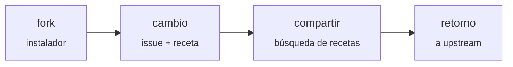

# Forkware

[English](manifesto.md) · [简体中文](manifesto.zh-CN.md) · **Español** · [Português](manifesto.pt-BR.md) · [Русский](manifesto.ru.md)

**Software que cada persona adapta a su medida.**

*Manifiesto · versión 0.1 · 2026-10-06*

Upstream es una **base común**, no un producto terminado. Cada usuario hace un fork y lo adapta a sus necesidades con ayuda de un agente de IA. Los mejores cambios vuelven al repositorio compartido.

## Las reglas

1. **Instalar es hacer fork.** El instalador hace fork del repositorio, clona el fork y ejecuta el programa desde él. Cada usuario es dueño de su propio código desde el primer minuto.

2. **Todo cambio empieza con un issue.** El cambio se describe en lenguaje humano sencillo. Primero, el agente comprueba si alguien ya lo ha resuelto.

3. **Una receta, no un parche.** Cada cambio se guarda como intención, especificación, tests y un diff de referencia. El diff se queda obsoleto; la intención permanece.

4. **Núcleo estrecho, bordes amplios.** El núcleo ofrece puntos de extensión. Las personalizaciones viven en la capa de extensiones y no tocan el núcleo salvo que realmente lo necesiten.

5. **Los tests son el contrato.** El núcleo está cubierto por tests, una receta sin tests nunca se aplica y la CI se ejecuta en cada fork.

6. **Las actualizaciones no rompen los cambios.** Cuando upstream publica una nueva versión, el agente vuelve a aplicar las recetas sobre el código nuevo y las verifica con tests en lugar de fusionar diffs antiguos.

7. **Confía, pero registra.** Una receta declara sus permisos y explica para qué los necesita. El programa registra lo que la receta hace realmente y da la alarma ante cualquier discrepancia. Una alarma en un fork avisa a todos.

8. **Selección en lugar de votación.** Una receta adoptada por muchos forks se convierte en candidata al núcleo. Upstream la incorpora por su cuenta.

9. **Tu fork es tuyo.** Puedes rechazar cualquier actualización y cualquier receta. El programa se adapta a la persona, y no al revés.

---

*Cada uno tiene su propio fork · Licencia: [CC0 1.0](https://creativecommons.org/publicdomain/zero/1.0/), haz un fork*
