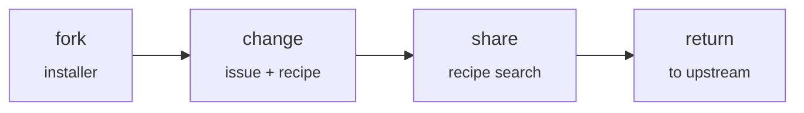

# Forkware

**English** · [简体中文](manifesto.zh-CN.md) · [Español](manifesto.es.md) · [Português](manifesto.pt-BR.md) · [Русский](manifesto.ru.md)

**Software that everyone shapes to fit themselves.**

*Manifesto · version 0.1 · 2026-10-06*

Upstream is a **common base**, not a finished product. Every user forks it and adapts it to their own needs with the help of an AI agent. The best changes flow back into the shared repository.

## The rules

1. **Installing means forking.** The installer forks the repository, clones the fork and runs the program from it. Every user owns their own code from the first minute.

2. **Every change starts with an issue.** A change is described in plain human language. First, the agent checks whether someone else has already solved it.

3. **A recipe, not a patch.** Every change is stored as intent, specification, tests and a reference diff. The diff goes stale; the intent stays.

4. **Narrow core, wide edges.** The core provides extension points. Customizations live in the extension layer and leave the core alone unless they truly need it.

5. **Tests are the contract.** The core is covered by tests, a recipe without tests is never applied, and CI runs in every fork.

6. **Updates don't break changes.** When upstream releases a new version, the agent re-applies the recipes to the fresh code and checks them with tests instead of merging old diffs.

7. **Trust, but record.** A recipe declares its permissions and explains why it needs them. The program records what the recipe actually does and raises an alarm on any mismatch. An alarm in one fork warns everyone.

8. **Selection instead of voting.** A recipe adopted by many forks becomes a candidate for the core. Upstream pulls it in on its own.

9. **Your fork belongs to you.** You can decline any update and any recipe. The program adapts to the person, not the other way around.

---

*Everyone has their own fork · License: [CC0 1.0](https://creativecommons.org/publicdomain/zero/1.0/), fork it*
