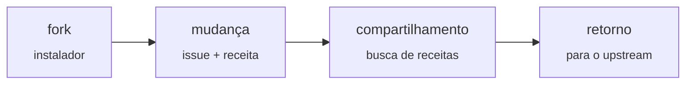

# Forkware

[English](manifesto.md) · [简体中文](manifesto.zh-CN.md) · [Español](manifesto.es.md) · **Português** · [Русский](manifesto.ru.md)

**Software que cada pessoa adapta do seu jeito.**

*Manifesto · versão 0.1 · 2026-10-06*

O upstream é uma **base comum**, não um produto pronto. Cada usuário faz um fork dele e o adapta às suas necessidades com a ajuda de um agente de IA. As melhores mudanças voltam para o repositório compartilhado.

## As regras

1. **Instalar é fazer fork.** O instalador faz fork do repositório, clona o fork e executa o programa a partir dele. Cada usuário é dono do próprio código desde o primeiro minuto.

2. **Toda mudança começa com uma issue.** A mudança é descrita em linguagem humana simples. Primeiro, o agente verifica se alguém já resolveu isso.

3. **Uma receita, não um patch.** Cada mudança é guardada como intenção, especificação, testes e um diff de referência. O diff envelhece; a intenção permanece.

4. **Núcleo estreito, bordas largas.** O núcleo oferece pontos de extensão. As personalizações vivem na camada de extensões e só mexem no núcleo quando realmente precisam.

5. **Os testes são o contrato.** O núcleo é coberto por testes, uma receita sem testes nunca é aplicada e o CI roda em todo fork.

6. **Atualizações não quebram as mudanças.** Quando o upstream lança uma nova versão, o agente reaplica as receitas ao código novo e as verifica com testes, em vez de mesclar diffs antigos.

7. **Confie, mas registre.** Uma receita declara suas permissões e explica por que precisa delas. O programa registra o que a receita realmente faz e dispara um alarme diante de qualquer divergência. Um alarme em um fork avisa todo mundo.

8. **Seleção em vez de votação.** Uma receita adotada por muitos forks vira candidata ao núcleo. O upstream a incorpora por conta própria.

9. **Seu fork é seu.** Você pode recusar qualquer atualização e qualquer receita. O programa se adapta à pessoa, e não o contrário.

---

*Cada um tem seu próprio fork · Licença: [CC0 1.0](https://creativecommons.org/publicdomain/zero/1.0/), faça um fork*
