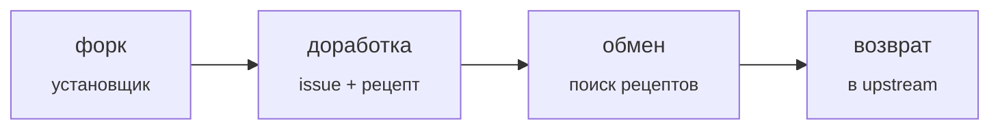

# Forkware

[English](manifesto.md) · [简体中文](manifesto.zh-CN.md) · [Español](manifesto.es.md) · [Português](manifesto.pt-BR.md) · **Русский**

**Программы, которые каждый дорабатывает под себя.**

*Манифест · версия 0.1 · 2026-10-06*

Upstream — это **общая основа**, а не готовый продукт. Каждый пользователь форкает её и дорабатывает под себя с помощью ИИ-агента. Лучшие доработки возвращаются в общий репозиторий.

## Правила

1. **Установка — это форк.** Установщик форкает репозиторий, клонирует форк и запускает программу из него. Свой код у пользователя есть с первой минуты.

2. **Любая доработка начинается с issue.** Доработка формулируется человеческим языком. Сначала агент ищет, не решил ли это уже кто-то другой.

3. **Рецепт, а не патч.** Каждая доработка хранится как намерение, спецификация, тесты и референсный diff. Diff устаревает, намерение остаётся.

4. **Узкое ядро, широкие края.** Ядро даёт точки расширения. Кастомизация живёт в слое расширений и не трогает ядро без нужды.

5. **Тесты — это контракт.** Ядро покрыто тестами, рецепт без тестов не применяется, CI работает в каждом форке.

6. **Обновление не ломает доработки.** При новой версии upstream агент заново применяет рецепты к свежему коду и проверяет их тестами вместо мержа старых диффов.

7. **Доверяй, но записывай.** Рецепт объявляет права и объясняет, зачем они нужны. Программа записывает, что он делает на самом деле, и поднимает тревогу при расхождении. Тревога одного форка предупреждает всех.

8. **Отбор вместо голосования.** Рецепт, который приняли многие форки, становится кандидатом в ядро. Upstream забирает его сам.

9. **Твой форк принадлежит тебе.** От любого обновления и любого рецепта можно отказаться. Программа подстраивается под человека, а не наоборот.

---

*У каждого свой форк · Лицензия: [CC0 1.0](https://creativecommons.org/publicdomain/zero/1.0/), форкай*
