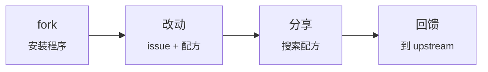

# Forkware

[English](manifesto.md) · **简体中文** · [Español](manifesto.es.md) · [Português](manifesto.pt-BR.md) · [Русский](manifesto.ru.md)

**人人都能按自己需求塑造的软件。**

*宣言 · 版本 0.1 · 2026-10-06*

Upstream 是**共同的基础**，而不是成品。每个用户都会 fork 它，并借助 AI 智能体按自己的需求进行改造。最好的改动会回流到共享仓库。

## 规则

1. **安装即 fork。** 安装程序会 fork 仓库、克隆该 fork，并从中运行程序。从第一分钟起，每个用户就拥有自己的代码。

2. **每个改动都从 issue 开始。** 改动用通俗的人类语言描述。智能体首先检查是否已经有人解决过这个问题。

3. **是配方，而不是补丁。** 每个改动都以意图、规格说明、测试和参考 diff 的形式保存。diff 会过时，意图不会。

4. **窄核心，宽边缘。** 核心提供扩展点。定制内容存在于扩展层中，除非确有必要，否则不触碰核心。

5. **测试即契约。** 核心有测试覆盖，没有测试的配方绝不应用，每个 fork 中都运行 CI。

6. **更新不会破坏改动。** 当 upstream 发布新版本时，智能体会把配方重新应用到新代码上，并用测试进行验证，而不是合并旧的 diff。

7. **信任，但要记录。** 配方声明自己需要的权限，并说明原因。程序记录配方的实际行为，一旦与声明不符就发出警报。一个 fork 中的警报会提醒所有人。

8. **以选择代替投票。** 被许多 fork 采用的配方会成为进入核心的候选。Upstream 会主动将其纳入。

9. **你的 fork 属于你。** 你可以拒绝任何更新和任何配方。程序适应人，而不是人适应程序。

---

*每个人都有自己的 fork · 许可证：[CC0 1.0](https://creativecommons.org/publicdomain/zero/1.0/)，fork it*
